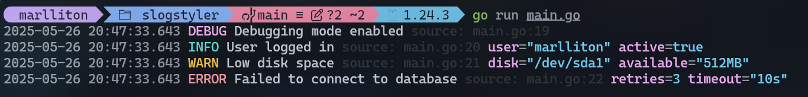
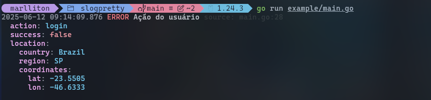
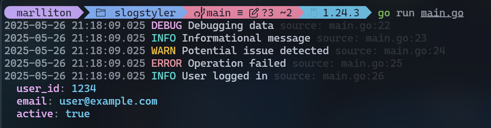
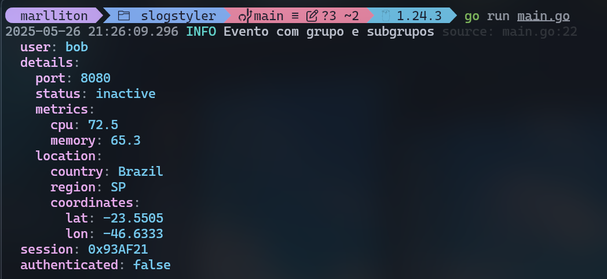

# slog-pretty ✨

Um handler personalizável e colorido para o [slog](https://pkg.go.dev/log/slog) handler em Go — projetado para saída estruturada, legível e bonita no terminal.



## Funcionalidades

- 🌈 **Níveis de log com cores** (DEBUG, INFO, WARN, ERROR)
- 📝 **Atributos estruturados** com formatação
- 📂 **Rastreamento inteligente da origem** (arquivo:linha)
- 🪄 **Modo multilinha** para dados complexos
- ⏱️ **Formatação personalidada de timestamp**

## Instalação

```bash
go get github.com/Marlliton/slogpretty
```

## Uso Básico

Configure o slogpretty como handler padrão:

```go
package main

import (
	"log/slog"
	"os"

	"github.com/Marlliton/slogpretty"
)

func main() {
	// Minimal setup
	handler := slogpretty.New(os.Stdout, nil)
	slog.SetDefault(slog.New(handler))

	slog.Info("Server started", "port", 8080)
}
```


## Configurações Avançadas

Você pode configurar o handler usando a struct `Options`:

```go
handler := slogpretty.New(os.Stdout, &slogpretty.Options{
	Level:      slog.LevelDebug,
	AddSource:  true,                            // Mostrar localização do arquivo
	Colorful:   true,                            // Habilitar cores. Valor padrão (true)
	Multiline:  true,                            // Impressão bonita para dados complexos
	TimeFormat: slogpretty.DefaultTimeFormat,    // Formato personalizado (ex: time.Kitchen)
})
```



## Funcionalidades

1. Níveis coloridos

   Cada nível de log tem uma cor distinta

2. Atributos estruturados

   Formatação limpa dos atributos

```go
	slog.Debug("Debugging data")
	slog.Info("Informational message")
	slog.Warn("Potential issue detected")
	slog.Error("Operation failed")
	slog.Info("User logged in", "user_id", 1234, "email", "user@example.com", "active", true)
```



3. Dados Complexos em Multiplas linhas

```go
	slog.Info("Evento com grupo e subgrupos",
		"user", "bob",
		slog.Group("details",
			slog.Int("port", 8080),
			slog.String("status", "inactive"),
			slog.Group("metrics",
				slog.Float64("cpu", 72.5),
				slog.Float64("memory", 65.3),
			),
			slog.Group("location",
				slog.String("country", "Brazil"),
				slog.String("region", "SP"),
				slog.Group("coordinates",
					slog.Float64("lat", -23.5505),
					slog.Float64("lon", -46.6333),
				),
			),
		),
		"session", "0x93AF21",
		"authenticated", false,
	)
```



## 💡 Boas práticas

### 🛠 Desenvolvimento: Habilite quantos recursos desejar

Em ambientes de desenvolvimento, é recomendável ativar o máximo de recursos possível para melhorar a leitura, depuração e rastreabilidade dos logs:

```go
&pretty.Options{
    Level:     slog.LevelDebug,
    AddSource: true,
    Colorful:  true,
    Multiline: true,
}
```

Essas opções permitem:

- **Logs a partir do nível de debug (`LevelDebug`)**
- **Rastreamento de origem (`AddSource`)**
- **Saída colorida para melhor visibilidade no terminal (`Colorful`)**
- **Formatação estruturada em várias linhas (`Multiline`)**

---

### 🚀 Produção: Use o `JSONHandler` nativo do `slog`

Para produção, é melhor usar o `slog.NewJSONHandler`, que gera logs em **formato JSON**:

```go
JSONhandler := slog.NewJSONHandler(os.Stdout, &slog.HandlerOptions{
	Level: slog.LevelInfo,
})
slog.SetDefault(slog.New(JSONhandler))

slog.Info("Event with groups and subgroups",
	"user", "bob",
	slog.Group("details",
		slog.Int("port", 8080),
		slog.String("status", "inactive"),
		slog.Group("metrics",
			slog.Float64("cpu", 72.5),
			slog.Float64("memory", 65.3),
		),
		slog.Group("location",
			slog.String("country", "Brazil"),
			slog.String("region", "SP"),
			slog.Group("coordinates",
				slog.Float64("lat", -23.5505),
				slog.Float64("lon", -46.6333),
			),
		),
	),
	"session", "0x93AF21",
	"authenticated", false,
)
```

#### ✅ Por que usar JSON em produção?

- **Compatível com ferramentas de observabilidade** (ex: Datadog, Loki, Grafana)
- **Formato altamente aceito** — facilita análise, busca etc.
- **Estrutura padronizada** — ideal para sistemas distribuídos e logs centralizados
- **Eficiente** — evita sobrecarga com formatação visual desnecessária
