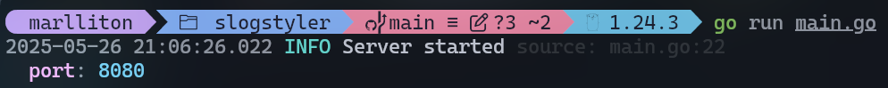

# slog-pretty ✨

A customizable and colorful [slog](https://pkg.go.dev/log/slog) handler for Go — designed for structured, readable, and pretty terminal output.


## Features

- 🌈 **Color-coded log levels** (DEBUG, INFO, WARN, ERROR)
- 📝 **Structured attributes** with pretty formatting
- 📂 **Smart source tracking** (file:line)
- 🪄 **Multiline mode** for complex data
- ⏱️ **Custom timestamp formatting**

## Installation

```bash
go get github.com/Marlliton/slogpretty
```

## Basic Usage

Set up slog-pretty as your default handler:

```go
package main

import (
	"log/slog"
	"os"

	"github.com/Marlliton/slogpretty"
)

func main() {
	// Minimal setup
	handler := slogpretty.New(os.Stdout, nil)
	slog.SetDefault(slog.New(handler))

	slog.Info("Server started", "port", 8080)
}
```


## Advanced Configuration

You can configure the handler using the Options struct:

```go
handler := slogpretty.New(os.Stdout, &slogpretty.Options{
	Level:      slog.LevelDebug,
	AddSource:  true,                           // Show source file location
	Colorful:   true,                           // Enable colors
	Multiline:  true,                           // Pretty-print complex data
	TimeFormat: slogpretty.DefaultTimeFormat, // Custom time format time.Kitchen
})
```



## Feature Showcase

1. Color-coded Levels

   Each log level has distinct coloring:

2. Structured Attributes

   Clean attribute formatting:

```go
	slog.Debug("Debugging data")
	slog.Info("Informational message")
	slog.Warn("Potential issue detected")
	slog.Error("Operation failed")
	slog.Info("User logged in", "user_id", 1234, "email", "user@example.com", "active", true)
```


3. Multiline Complex Data

   Beautiful nested structures:

```go
	slog.Info("Evento com grupo e subgrupos",
		"user", "bob",
		slog.Group("details",
			slog.Int("port", 8080),
			slog.String("status", "inactive"),
			slog.Group("metrics",
				slog.Float64("cpu", 72.5),
				slog.Float64("memory", 65.3),
			),
			slog.Group("location",
				slog.String("country", "Brazil"),
				slog.String("region", "SP"),
				slog.Group("coordinates",
					slog.Float64("lat", -23.5505),
					slog.Float64("lon", -46.6333),
				),
			),
		),
		"session", "0x93AF21",
		"authenticated", false,
	)
```


## 💡 Best Practices

### 🛠 Development: Enable as many features as you want

In development environments, it’s recommended to enable as many features as possible to improve log readability, debugging, and traceability:

```go
&pretty.Options{
    Level:     slog.LevelDebug,
    AddSource: true,
    Colorful:  true,
    Multiline: true,
}
```

These options enable:

- **Detailed logs (`LevelDebug`)**
- **Log origin tracking (`AddSource`)**
- **Colorful output for better terminal visibility (`Colorful`)**
- **Structured multi-line formatting (`Multiline`)**

---

### 🚀 Production: Use `slog`'s built-in `JSONHandler`

For production, it’s best to use `slog.NewJSONHandler`, which outputs logs in **structured JSON format**:

```go
JSONhandler := slog.NewJSONHandler(os.Stdout, &slog.HandlerOptions{
	Level: slog.LevelInfo,
})
slog.SetDefault(slog.New(JSONhandler))

slog.Info("Event with groups and subgroups",
	"user", "bob",
	slog.Group("details",
		slog.Int("port", 8080),
		slog.String("status", "inactive"),
		slog.Group("metrics",
			slog.Float64("cpu", 72.5),
			slog.Float64("memory", 65.3),
		),
		slog.Group("location",
			slog.String("country", "Brazil"),
			slog.String("region", "SP"),
			slog.Group("coordinates",
				slog.Float64("lat", -23.5505),
				slog.Float64("lon", -46.6333),
			),
		),
	),
	"session", "0x93AF21",
	"authenticated", false,
)
```

#### ✅ Why use JSON in production?

- **Compatible with observability tools** (e.g., Datadog, ELK, Loki, Grafana)
- **Machine-readable format** — makes parsing, searching, and aggregating easier
- **Standardized structure** — ideal for distributed systems and centralized logging
- **Efficient** — avoids unnecessary visual formatting overhead
